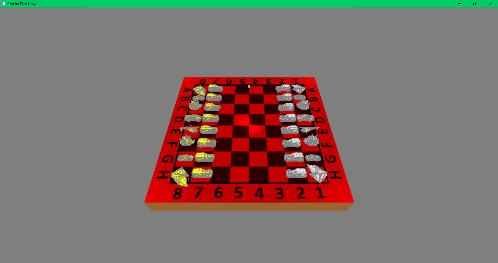
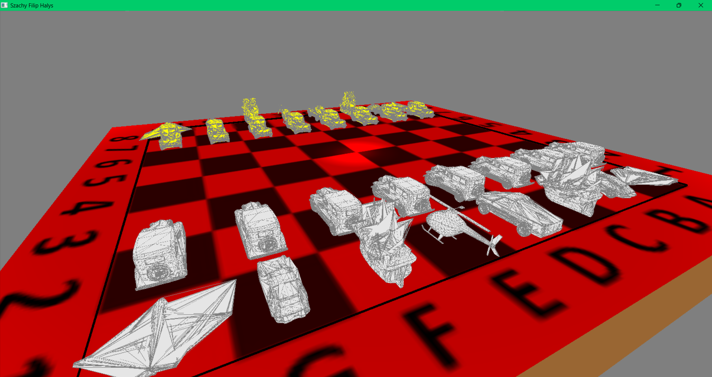
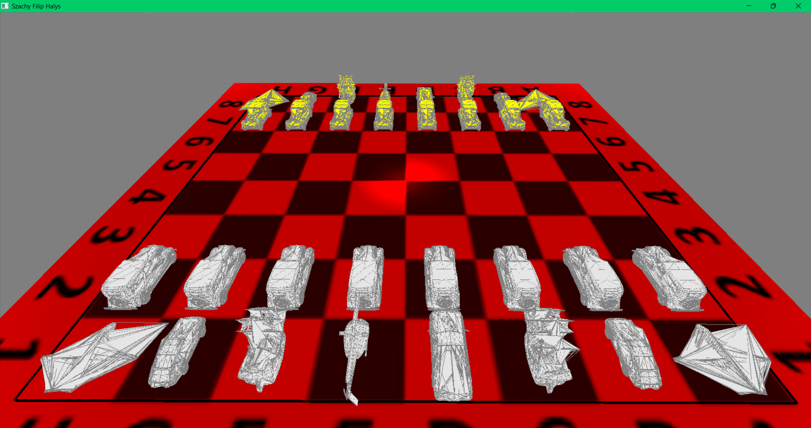

# Chessboard view and chess pieces represented as vehicles.

## Program created as part of the 3D Computer Graphics course. Project implemented in C and C++ using the OpenGL graphics library.

To run the program, you need to open the file [szablon.sln](https://github.com/filiphalys02/Vehicle-Chess/blob/main/szablon.sln) in an IDE (Visual Studio) and compile it. After compiling, the application window should appear. 

As seen in the above screenshots, the board is created based on a texture. Lighting has also been added to the view, shining vertically downward onto the chessboard.

The pieces have been divided into two teams: yellow and white. Instead of classical characters, the types of pieces have taken the form of modes of transportation:
- pawn: old car
- rook: airplane
- knight: porsche
- bishop: ship
- king: helicopter
- queen: ram